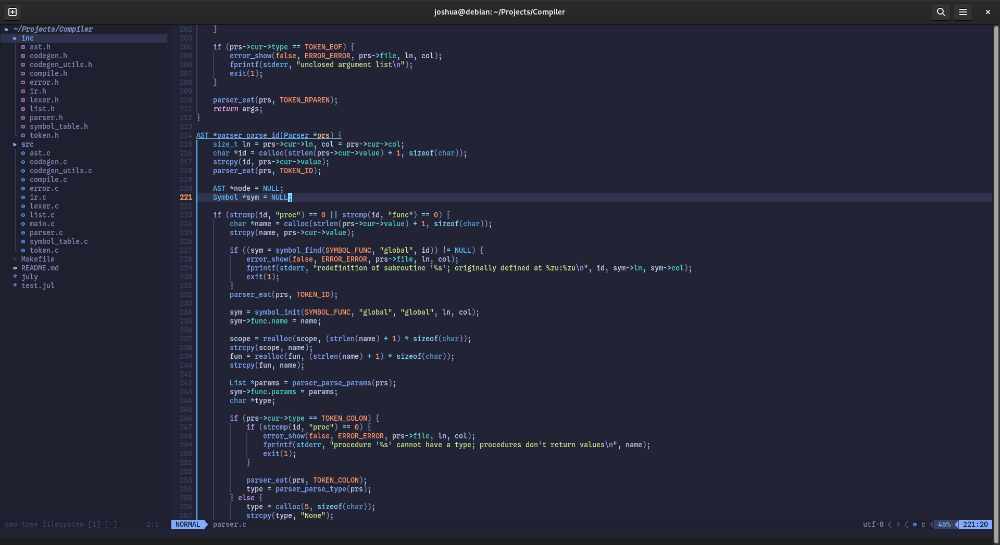

# nvim

My neovim config.



## Installation

> Requires the latest version of neovim

```bash
git clone https://github.com/JoshuaJKK/nvim.git ~/.config/nvim
```

Then in neovim run:

```
:Lazy
```

Then press <kbd>I</kbd> (capital 'i').
